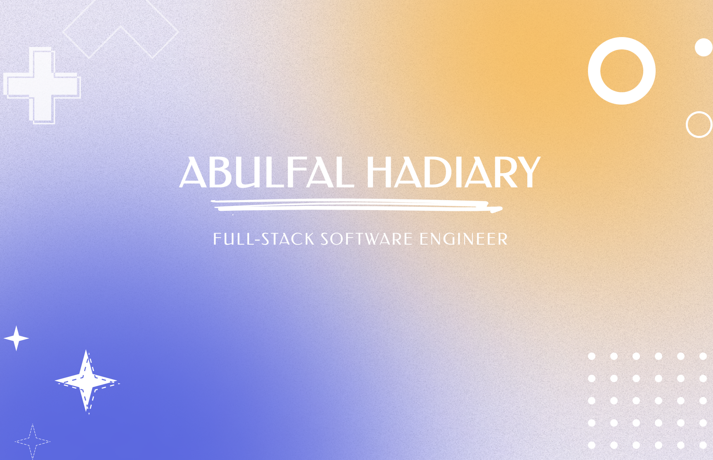

# Hello, there! 

<!--  -->

### 🤔 About
-  **Working :**  Web Development :computer:
-  **Learning :** Full-Stack :zap: | Data Structures & Algorithms
-  **Hobbies :** Books :books: | Sports :weight_lifting: :men_wrestling: :biking_man:
-  **Ask me about :** Anything!, I'm happy to help :v:
-  **Pronouns :** He/Him

<!-- 
  
 -->

### Technologies

 

 

 
